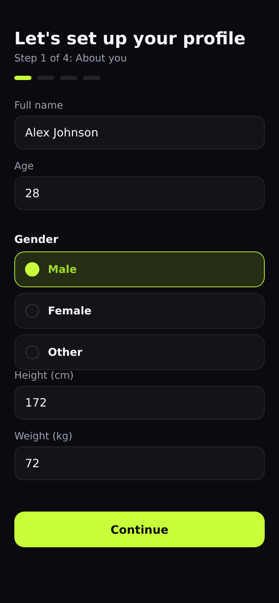
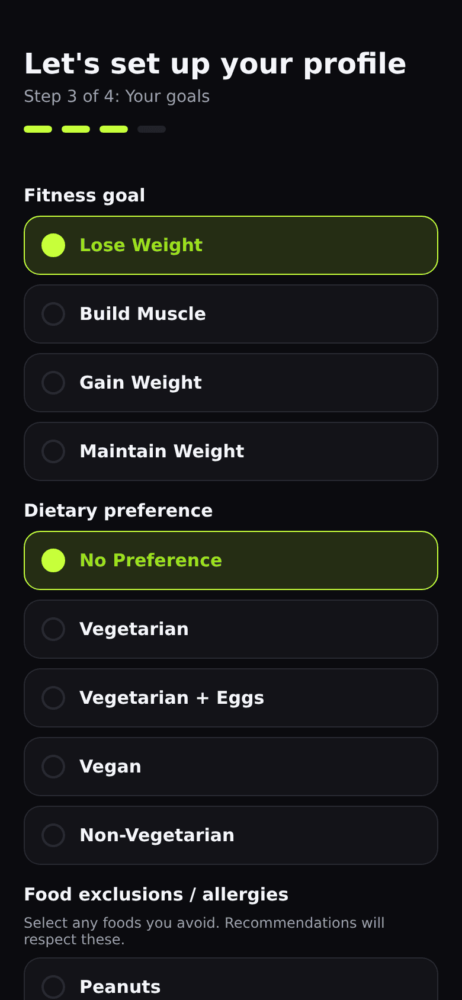
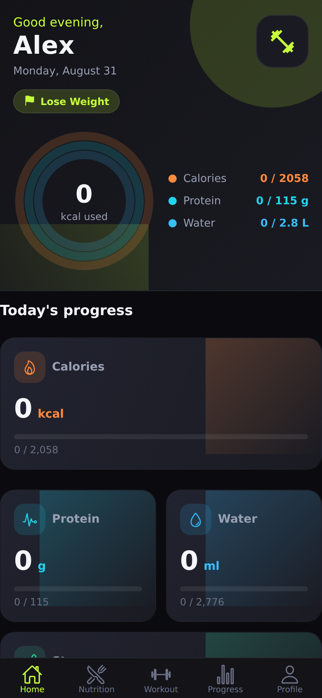
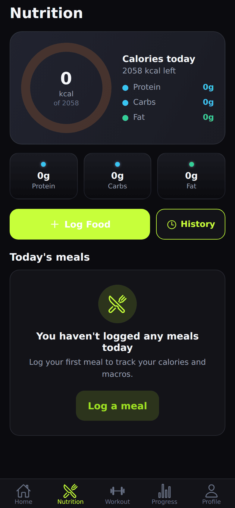
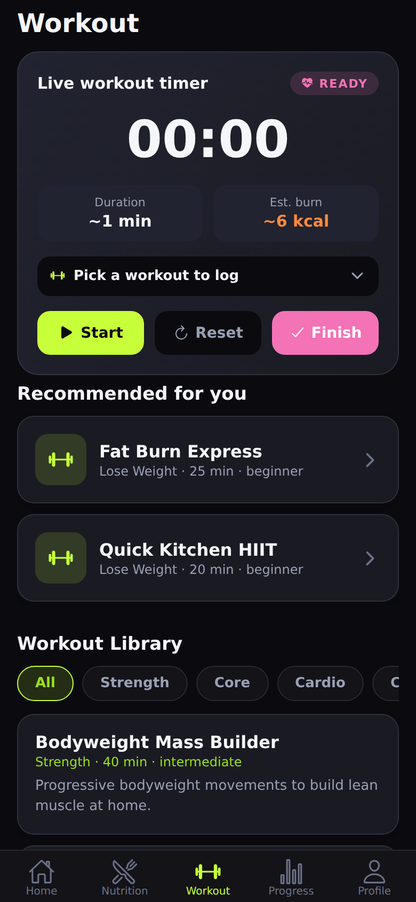
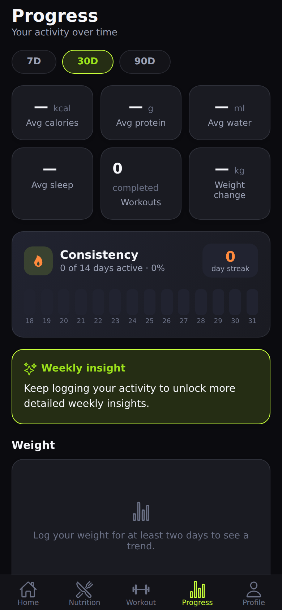
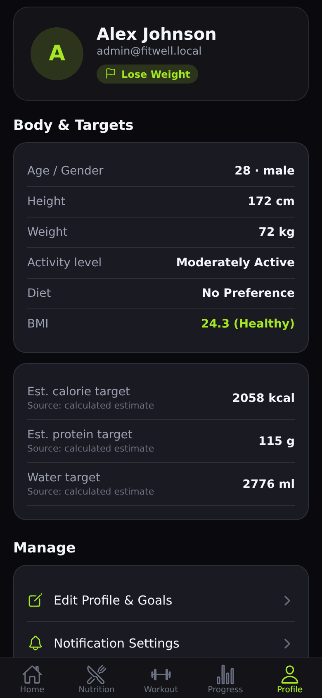

# FitWell

FitWell is a mobile-first wellness and fitness app with:

- **`mobile/`** — React Native (Expo SDK 57) + TypeScript app with nutrition, hydration, weight, sleep, step and workout tracking, a rule-based recommendation engine (with optional AI abstraction), and a non-medical onboarding flow.
- **`server/`** — Local backend: Node.js + Express + SQLite, with JWT auth, per-user data isolation (server-side), a seeded reference library (Indian-priority foods, exercises, workouts), and admin endpoints.
- **`admin/`** — A web admin dashboard (React + Vite + TypeScript) for managing foods, exercises, workouts and users.
- **`supabase/`** — Legacy reference: the original PostgreSQL/RLS schema and SQL seeds (kept for reference; the live backend now runs on SQLite + Node).
- **`manage.sh`** — Convenience service manager to run everything together.

> **Note:** All calorie and nutrition values in FitWell are *estimates*. The app always labels targets as "estimated" and is not a medical tool.

---

## Screenshots

A quick visual walkthrough of the app, from the first run to daily tracking
(phone-shaped captures at 390×844). Thumbnails are shown small; click a **View
larger** link to open the full image in a new tab.

---

### 1. Onboarding — About You

<a href="screenshots/05-onboarding-about.png"></a>

[View larger](screenshots/05-onboarding-about.png)

**What it is:** the first step of the setup wizard a new user completes.

**How it works:** FitWell needs a little about you — **full name, age, gender,
height, and weight** — to make every goal personal. None of this is shared with
anyone; it stays in the app's own local database. Everything is optional-friendly
and clearly labeled as estimates, not medical advice.

---

### 2. Onboarding — Goals & Diet

<a href="screenshots/07-onboarding-goals.png"></a>

[View larger](screenshots/07-onboarding-goals.png)

**What it is:** step three of the wizard, where the app learns what you're trying
to achieve.

**How it works:** you pick a **fitness goal** (e.g. lose weight), a **dietary
preference**, and any **food exclusions or allergies**. FitWell uses these to
compute your daily targets and to power its recommendation engine — so the meals
and workouts you're shown actually fit your goals and restrictions.

---

### 3. Home Dashboard

<a href="screenshots/09-home.png"></a>

[View larger](screenshots/09-home.png)

**What it is:** the main screen you land on each day.

**How it works:** the **animated activity rings** show your progress toward your
daily **calorie, protein, and water** targets at a glance. Cards below surface
your recommended meal, today's workout, and a personal insight — all generated
from your profile and your logged activity for that day.

---

### 4. Nutrition

<a href="screenshots/10-nutrition.png"></a>

[View larger](screenshots/10-nutrition.png)

**What it is:** the daily food tracker.

**How it works:** it shows the **calories you've consumed today versus your goal**
(here 0 kcal of 2,058) plus your **macro breakdown** (protein, carbs, and fat).
Tap **Log Food** to add a meal from the built-in food library, and **History** to
review past days.

---

### 5. Workout

<a href="screenshots/11-workout.png"></a>

[View larger](screenshots/11-workout.png)

**What it is:** the workout tracker with a live timer.

**How it works:** the **live workout timer** tracks your session in real time with
an estimated calorie burn, while the **"Recommended for you"** section suggests
workouts matched to your goal and fitness level. Start a routine, follow along,
and finish to log it to your history.

---

### 6. Progress

<a href="screenshots/12-progress.png"></a>

[View larger](screenshots/12-progress.png)

**What it is:** your long-term view of activity.

**How it works:** it charts your **average calories, protein, water, and sleep**
over **7 / 30 / 90-day** windows, along with **workouts completed** and **weight
change** over time — so you can see real trends, not just today's numbers.

---

### 7. Profile & Targets

<a href="screenshots/13-profile.png"></a>

[View larger](screenshots/13-profile.png)

**What it is:** your saved personal details and calculated goals.

**How it works:** this summarizes everything FitWell knows about you — age,
gender, height, weight, activity level, and diet — alongside the **daily targets
it calculated** from that profile. You can sign out or edit your details here.

---

All screenshots are also available individually in the **`screenshots/`** folder
(the full-size images also appear in the repo's GitHub image viewer). The demo
login used in the captures is `admin@fitwell.local` / `admin123`.

---

## Quick start (run everything locally)

The fastest way to bring up all four services is the service manager:

```bash
./manage.sh start      # starts api, admin, mobile, static
./manage.sh status     # shows what's running and which ports respond
./manage.sh logs       # tail all logs (Ctrl-C to exit)
./manage.sh stop       # stop everything
```

Or run each piece by hand:

```bash
# 1. Start the backend (creates + seeds SQLite on first run)
cd server
npm install
npm start                 # http://localhost:4000

# 2. Start the mobile app
cd ../mobile
cp .env.example .env      # EXPO_PUBLIC_API_URL
npm install
npm start                 # press w for web (or i / a for device)

# 3. Start the admin dashboard
cd ../admin
cp .env.example .env      # VITE_API_URL
npm install
npm run dev               # http://localhost:5173

# 4. (Optional) Serve the static mobile web export
cd ../mobile
npx expo export -p web    # builds dist/
npx serve -l 19006 dist   # http://localhost:19006
```

The first `npm start` in `server/` seeds the database automatically (55 foods,
22 exercises, 12 workouts) and creates a **demo admin** login:

```
email:    admin@fitwell.local
password: admin123
```

> **Is this credential safe to publish?** Yes. This is a **local, demo-only** seed
> account created fresh on *every* machine that runs the code — it does **not**
> exist on any shared/cloud server and protects nothing. Each person who clones
> the repo gets their own local copy of it. It's provided purely so you can sign
> into the admin dashboard immediately after first boot.

Sign in as this account on the admin dashboard to manage data and promote/demote
users. On the mobile app you can either create a new account or sign in with any
account (a normal, non-admin user).

> **Service manager:** `manage.sh` also supports a single service:
> `./manage.sh api start|stop|status`, and the same for `admin`, `mobile`, `static`.

### Ports

| Service | URL |
|---------|-----|
| API (Express/SQLite) | http://localhost:4000 |
| Admin dashboard (Vite dev) | http://localhost:5173 |
| Mobile app (Expo dev web) | http://localhost:8081 |
| Mobile app (static export) | http://localhost:19006 |

> The admin dev server occupies port **5173** via `--strictPort`. If another local
> Vite project (e.g. Customer Support Intelligence) is already running on 5173,
> stop that app first, or run the admin on a different port, before starting it.

---

## Repository layout

```
fitwell/
├── mobile/          Expo React Native app (talks to the server via REST)
│   ├── src/
│   │   ├── app/             Expo Router screens (auth, tabs, onboarding, …)
│   │   ├── components/      UI components (Button, Field, ActivityRings, …)
│   │   ├── features/        Onboarding, auth screen container, etc.
│   │   ├── hooks/           useTodayData, useDashboard, useAIContext, …
│   │   ├── services/        API client + REST modules
│   │   ├── store/           authStore (zustand)
│   │   └── assets/ favicon  Branded favicon (png / ico / apple-touch)
│   ├── tests/               Unit tests (calculations + recommendations)
│   └── dist/                Static web export (generated)
├── server/          Node + Express + SQLite backend
│   ├── src/
│   │   ├── index.js        Express app + route wiring
│   │   ├── db.js           SQLite connection + schema
│   │   ├── seed.js         Idempotent seeder (reference data + demo admin)
│   │   ├── auth.js         Password hashing, JWT, auth/admin middleware
│   │   └── routes/         auth, profile, foods, food-logs, water, weight,
│   │                       sleep, workouts, workout-logs, steps, notifications,
│   │                       ai, admin
│   └── data/               SQLite database (created at runtime)
├── admin/           Web admin dashboard (Vite) — calls the same server
├── screenshots/     Phone-shaped UI captures (for docs / submissions)
└── supabase/        Legacy reference schema + SQL seeds (see note above)
```

---

## Prerequisites

- Node.js 20+ and npm
- An Expo development environment (for the mobile app)

No external database or cloud account is required — everything persists to a
local SQLite file at `server/data/fitwell.db`.

---

## Connecting the app to the server

The mobile and admin apps talk to the FitWell server over REST. The base URL is
read at build time from an environment variable:

- **mobile:** `EXPO_PUBLIC_API_URL` (default `http://fitwell.local:4000`)
- **admin:** `VITE_API_URL` (default `http://fitwell.local:4000`)

On **web** (`window.location` available) the mobile API client derives the server
host from the page's own origin (port 4000), so it works whether you open
`http://localhost:19006`, `http://fitwell.local:19006`, or reach it by LAN IP —
no per-setup env change needed. On a **physical device** set `EXPO_PUBLIC_API_URL`
to your machine's LAN IP, e.g. `http://192.168.1.10:4000`.

---

## Backend (server/)

```bash
cd server
npm install
npm start             # http://localhost:4000  (auto-seeds on boot)
npm run seed          # (re)seed reference data + demo admin explicitly
```

Configuration is optional via environment variables (see `server/.env.example`):
`PORT`, `FITWELL_DB_PATH`, `FITWELL_JWT_SECRET`, `FITWELL_AI_API_KEY`.

### How security works

- **Auth:** passwords are hashed with Node's `crypto.scrypt`. A successful
  login/register returns a JWT which the app stores and sends as
  `Authorization: Bearer <token>`.

  > **Note:** If no `FITWELL_JWT_SECRET` is set, the server falls back to a
  > fixed local-dev secret (`fitwell-local-dev-secret-change-me`). This is safe
  > because the server runs only on the user's own machine against their own
  > local database — but you should set `FITWELL_JWT_SECRET` in `server/.env`
  > for any long-running or shared deployment.
- **Per-user data isolation (replaces RLS):** every user-data route derives the
  user id from the verified token and scopes all queries by it. The server
  ignores any user id the client supplies.
- **Admin:** `requireAdmin` re-reads the user's role from the database on every
  request (it never trusts a stale token claim), so demoting a user immediately
  revokes their admin access.

### External AI (optional)

The app works fully without any AI key (it uses rule-based recommendations). If
you want real LLM-powered responses later, the server exposes
`POST /api/ai/generate`; wire it to a provider and set `FITWELL_AI_API_KEY`. When
no key is configured the server returns 501 and the app falls back to rules.

---

## Mobile app

```bash
cd mobile
cp .env.example .env     # set EXPO_PUBLIC_API_URL
npm install
npm start                # press w for web, or i / a for a device
```

- `npm run typecheck` — run the TypeScript compiler.
- `npm run test` — run unit tests (calculations + recommendation filtering).
- `npm run lint` — run ESLint.

### Static web export

The app targets `web.output: "static"` in `app.json`, so it can be exported to a
self-contained folder and served statically (great for demos and screenshots):

```bash
cd mobile
npx expo export -p web     # writes dist/
npx serve -l 19006 dist    # http://localhost:19006
```

The root layout injects the branded favicon and page `<title>` via
`<Head>` from `expo-router/head`. New favicons live at
`mobile/assets/favicon.{png,ico}` and `mobile/public/favicon.{png,ico}`.

### Cross-platform alerts

All in-app notifications use `showAlert()` (`mobile/src/utils/alert.ts`), which
uses native `Alert` on iOS/Android and falls back to `window.alert`/`window.confirm`
on web — this is what makes error messages (e.g. a bad login) visible in the web
demo, where React Native's `Alert` is a silent no-op.

### Onboarding

After creating/signing in, new users complete a 4-step profile wizard
("About you → Activity → Goals → Confirm"). It computes estimated daily targets
via `mobile/src/services/calculations.ts` and saves the profile to the server.
Default onboarding values come from `src/constants/index.ts` (step goal 8000,
sleep goal 480 min, etc.).

---

## Admin dashboard

```bash
cd admin
cp .env.example .env     # set VITE_API_URL
npm install
npm run dev              # http://localhost:5173
npm run build            # typecheck + production build
npm run preview          # serve the production build
```

Sign in with an account that has the `admin` role (the seeded demo admin is
`admin@fitwell.local` / `admin123`). The dashboard calls server endpoints that
verify the admin role in the database — never the client.

---

## Testing

- Mobile: `cd mobile && npm test` (Node test runner + `tsx`, no device required).
- Type checks: `cd mobile && npm run typecheck` and `cd admin && npm run build`.
- Backend: start `server/`, then exercise the REST endpoints (see
  `server/src/routes/`).

See `ASSUMPTIONS.md` for documented design decisions and limitations.

---

## License

Released under the [MIT License](LICENSE).

> Note: `mobile/LICENSE` is the MIT notice that ships with the Expo template
> and governs that template code; your own project's terms are the root
> `LICENSE` above.
